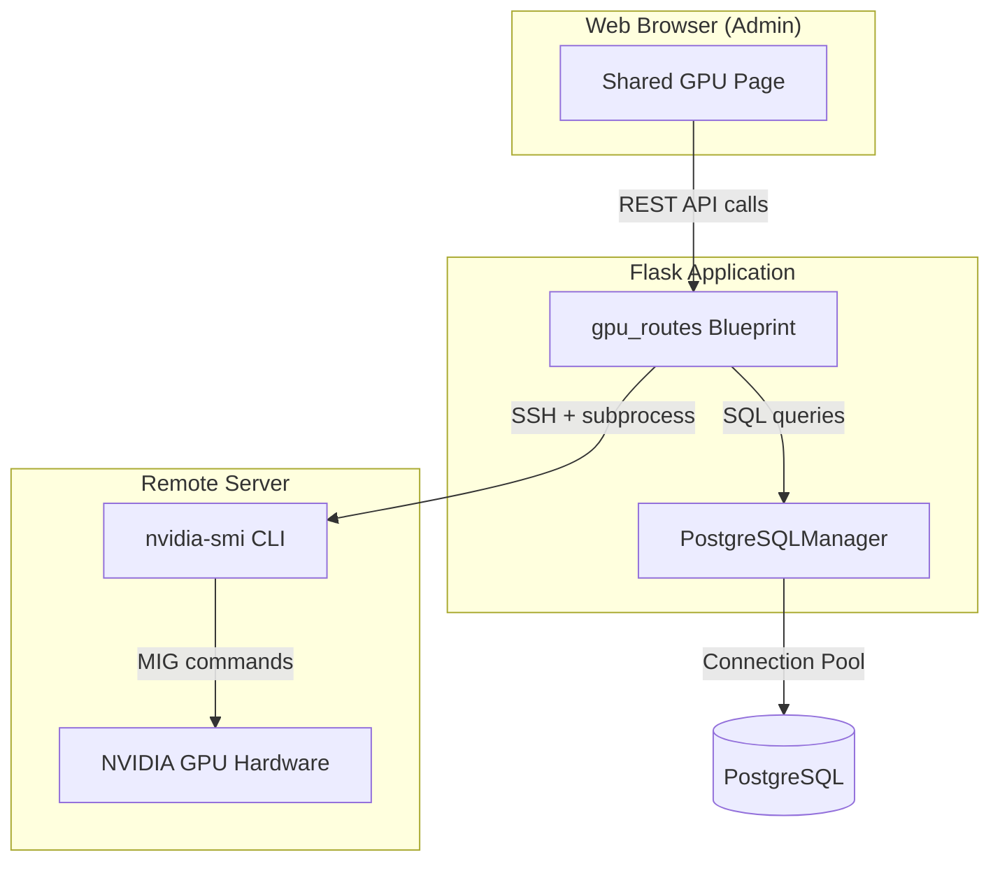
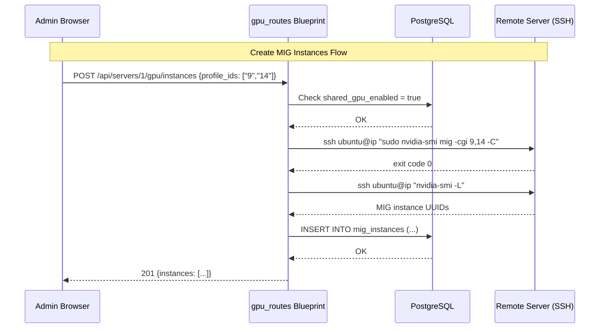

# Design Document: MIG Shared GPU

## Overview

This design adds NVIDIA Multi-Instance GPU (MIG) support to the SwAutoMorph platform, enabling administrators to partition NVIDIA GPUs (e.g., H100) into multiple isolated instances for shared workload execution. The feature spans four layers:

1. **Platform initialization** — installing NVIDIA drivers and enabling MIG mode during server setup (`init_pltf.sh`)
2. **Database schema** — persisting MIG profiles, instances, and server GPU state
3. **REST API** — Flask blueprint endpoints for MIG management operations via SSH
4. **Web UI** — admin-only page for GPU configuration and instance lifecycle management

The design follows existing platform conventions: Flask Blueprints for routing, `PostgreSQLManager` singleton for database operations, `subprocess` SSH calls for remote server commands, and Jinja2 templates extending `base.html`.

## Architecture



### Key Design Decisions

1. **Dedicated Blueprint**: A new `gpu_routes.py` file under `src/routes/` following the `orchestrator_routes.py` pattern. Prefix: `/api/servers/<server_id>/gpu`.

2. **SSH execution pattern**: Reuse the existing `subprocess.run()` + SSH pattern from `orchestrator_routes.py` with `StrictHostKeyChecking=no` and a 30-second timeout for GPU commands.

3. **Transactional consistency**: MIG instance creation/destruction persists database records only after successful CLI command execution. If the CLI fails, no DB mutation occurs.

4. **Migration-based schema evolution**: A new SQL migration file (`migration/add_mig_gpu.sql`) following the pattern established by `add_serverless_jobs.sql`.

5. **Admin-only access**: All GPU management endpoints enforce admin authentication using the session-based pattern (`session.get('is_admin')`).

## Components and Interfaces

### 1. Platform Init Script Extension (`init_pltf.sh`)

New section added after the Docker installation block:

```bash
# Install NVIDIA GPU Drivers and MIG Support
print_step "Installing NVIDIA GPU drivers..."
sudo apt install -y nvidia-driver-550 nvidia-utils-550 > /dev/null 2>&1
if [ $? -eq 0 ]; then
    print_success "NVIDIA drivers installed"
    
    print_step "Enabling MIG mode..."
    sudo nvidia-smi -mig 1 > /dev/null 2>&1
    if [ $? -eq 0 ]; then
        print_success "MIG mode enabled"
    else
        print_warning "MIG mode could not be enabled (GPU may not support MIG)"
    fi
    
    print_step "Installing NVIDIA Container Toolkit..."
    sudo apt install -y nvidia-container-toolkit > /dev/null 2>&1
    if [ $? -eq 0 ]; then
        print_success "NVIDIA Container Toolkit installed"
        
        print_step "Verifying Docker GPU access..."
        timeout 30 docker run --rm --gpus '"device=0"' nvidia/cuda:12.3.0-base-ubuntu22.04 nvidia-smi > /dev/null 2>&1
        if [ $? -eq 0 ]; then
            print_success "Docker GPU access verified"
        else
            print_warning "Docker GPU access verification failed (GPU may not be available)"
        fi
    else
        print_warning "NVIDIA Container Toolkit installation failed"
    fi
else
    print_warning "NVIDIA driver installation failed (no GPU or incompatible hardware), skipping GPU setup"
fi
```

### 2. GPU Routes Blueprint (`src/routes/gpu_routes.py`)

```python
# Blueprint: gpu_bp
# Prefix: /api/servers/<int:server_id>/gpu
# Auth: Admin-only (session-based)

# Endpoints:
# GET  /profiles    - List available MIG profiles from GPU hardware
# GET  /instances   - List active MIG instances from database
# POST /instances   - Create MIG instances (1-7 profile IDs)
# DELETE /instances - Destroy all MIG instances on server
# PUT  /enabled     - Toggle shared_gpu_enabled flag
```

**Helper functions:**

- `require_admin()` — checks `session.get('user_id')` and `session.get('is_admin')`
- `get_server_ip(server_id)` — queries the `servers` table for the IP address
- `ssh_execute(server_ip, command, timeout=30)` — executes a command via SSH on the target server
- `parse_mig_profiles(output)` — parses `nvidia-smi mig -lgip` output into structured data
- `parse_mig_instances(output)` — parses `nvidia-smi -L` output to extract MIG instance UUIDs

### 3. Shared GPU Page (`templates/shared_gpu.html`)

A new template extending `base.html` with:
- Server identification header
- Shared GPU toggle switch
- Available MIG profiles table (loaded from GPU via API)
- Profile selection checkboxes + "Create Instances" button
- Active MIG instances table with "Destroy All" button
- Status messages / error display area

### 4. Main Routes Extension (`src/routes/main_routes.py`)

A new route to serve the Shared GPU page:
```python
@main_bp.route('/servers/<int:server_id>/gpu')
def shared_gpu_page(server_id):
    # Admin-only check
    # Render shared_gpu.html with server_id context
```

### 5. Migration File (`migration/add_mig_gpu.sql`)

SQL migration to add MIG-related tables and columns.

## Data Models

### Database Schema Changes

#### 1. ALTER `servers` table — add `shared_gpu_enabled` column

```sql
ALTER TABLE servers ADD COLUMN IF NOT EXISTS shared_gpu_enabled BOOLEAN DEFAULT FALSE;
```

#### 2. New table: `mig_profiles`

```sql
CREATE TABLE IF NOT EXISTS mig_profiles (
    id SERIAL PRIMARY KEY,
    server_id INTEGER NOT NULL REFERENCES servers(id) ON DELETE CASCADE,
    profile_name VARCHAR(64) NOT NULL,
    profile_id VARCHAR(128) NOT NULL,
    gpu_memory_gb INTEGER NOT NULL CHECK (gpu_memory_gb BETWEEN 1 AND 80),
    created_at TIMESTAMP DEFAULT CURRENT_TIMESTAMP,
    UNIQUE (server_id, profile_name)
);

CREATE INDEX idx_mig_profiles_server_id ON mig_profiles(server_id);
```

#### 3. New table: `mig_instances`

```sql
CREATE TABLE IF NOT EXISTS mig_instances (
    id SERIAL PRIMARY KEY,
    server_id INTEGER NOT NULL REFERENCES servers(id) ON DELETE CASCADE,
    instance_uuid VARCHAR(36) NOT NULL,
    profile_name VARCHAR(50) NOT NULL,
    gpu_memory_mb INTEGER NOT NULL CHECK (gpu_memory_mb BETWEEN 1 AND 81920),
    created_at TIMESTAMP DEFAULT CURRENT_TIMESTAMP,
    UNIQUE (server_id, instance_uuid)
);

CREATE INDEX idx_mig_instances_server_id ON mig_instances(server_id);
```

### Data Flow



### API Request/Response Models

**PUT `/api/servers/<server_id>/gpu/enabled`**
```json
// Request
{"enabled": true}

// Response 200
{"server_id": 1, "shared_gpu_enabled": true}
```

**GET `/api/servers/<server_id>/gpu/profiles`**
```json
// Response 200
{
  "profiles": [
    {"profile_id": "9", "name": "1g.10gb", "memory_mib": 10240},
    {"profile_id": "14", "name": "2g.20gb", "memory_mib": 20480},
    {"profile_id": "19", "name": "4g.40gb", "memory_mib": 40960}
  ]
}
```

**GET `/api/servers/<server_id>/gpu/instances`**
```json
// Response 200
{
  "instances": [
    {
      "instance_uuid": "MIG-abc123-...",
      "profile_name": "1g.10gb",
      "gpu_memory_mb": 10240,
      "created_at": "2025-01-15T10:30:00Z"
    }
  ]
}
```

**POST `/api/servers/<server_id>/gpu/instances`**
```json
// Request
{"profile_ids": ["9", "14", "9"]}

// Response 201
{
  "message": "MIG instances created successfully",
  "instances": [
    {"instance_uuid": "MIG-abc...", "profile_name": "1g.10gb", "gpu_memory_mb": 10240}
  ]
}
```

**DELETE `/api/servers/<server_id>/gpu/instances`**
```json
// Response 200
{"message": "All MIG instances destroyed", "count": 3}
```


## Correctness Properties

*A property is a characteristic or behavior that should hold true across all valid executions of a system — essentially, a formal statement about what the system should do. Properties serve as the bridge between human-readable specifications and machine-verifiable correctness guarantees.*

### Property 1: MIG profile list ordering

*For any* set of MIG profiles stored in the database for a given server, querying the profiles endpoint SHALL return them in ascending order by profile name.

**Validates: Requirements 4.2**

### Property 2: nvidia-smi profile output parsing

*For any* valid `nvidia-smi mig -lgip` output string containing one or more profile entries, the parser SHALL extract every profile entry as a structured object with an integer profile_id, a non-empty string name, and a positive integer memory_mib, with the count of extracted entries matching the count of profile lines in the input.

**Validates: Requirements 6.2**

### Property 3: MIG instance creation command construction

*For any* list of profile IDs with length between 1 and 7 (inclusive), the system SHALL construct the command string as `sudo nvidia-smi mig -cgi <comma_separated_ids> -C` where the comma-separated IDs preserve the input order and contain all provided IDs.

**Validates: Requirements 7.1**

### Property 4: Profile ID list validation rejects invalid lengths

*For any* list of profile IDs with length 0 or length greater than 7, the validation function SHALL reject the input and return an error, never constructing or executing a command.

**Validates: Requirements 7.2, 11.9**

### Property 5: nvidia-smi instance output parsing

*For any* valid `nvidia-smi -L` output string containing MIG device entries, the parser SHALL extract every MIG instance UUID matching the pattern `MIG-<uuid>` and its associated profile name, with the count of extracted instances matching the count of MIG device lines in the input.

**Validates: Requirements 7.4**

## Error Handling

### SSH Command Failures

| Scenario | Behavior |
|----------|----------|
| Server unreachable (SSH connection refused/timeout) | Return HTTP 500 with message "Server unreachable: connection timed out" |
| Command returns non-zero exit code | Return HTTP 500 with truncated stderr (max 4096 chars) |
| Command exceeds 30-second timeout | Kill subprocess, return HTTP 500 with timeout message |
| SSH authentication failure | Return HTTP 500 with "SSH authentication failed" message |

### Database Failures

| Scenario | Behavior |
|----------|----------|
| FK violation (invalid server_id) | Return HTTP 404 "Server not found" |
| Unique constraint violation (duplicate UUID) | Return HTTP 409 "MIG instance already exists" |
| Unique constraint violation (duplicate profile) | Return HTTP 409 "Profile already exists for this server" |
| Connection pool exhausted | Retry up to 3x with exponential backoff (existing pattern) |

### API Validation Errors

| Scenario | HTTP Code | Response |
|----------|-----------|----------|
| Missing/invalid `enabled` boolean in PUT body | 400 | `{"error": "Field 'enabled' must be a boolean"}` |
| Empty `profile_ids` array | 400 | `{"error": "profile_ids must contain 1 to 7 entries"}` |
| More than 7 `profile_ids` | 400 | `{"error": "profile_ids must contain 1 to 7 entries"}` |
| Non-existent profile ID in request | 400 | `{"error": "Invalid profile ID: <id>"}` |
| Server has `shared_gpu_enabled = false` on create | 400 | `{"error": "Shared GPU must be enabled first"}` |
| No MIG instances exist on destroy | 400 | `{"error": "No MIG instances configured on this server"}` |
| Unauthenticated request | 401 | `{"error": "Authentication required"}` |
| Non-admin request | 403 | `{"error": "Admin access required"}` |
| Server not found | 404 | `{"error": "Server not found"}` |

### Partial Failure Handling

- **MIG creation succeeds but `nvidia-smi -L` fails**: Return HTTP 500 with message "Instances created but detail retrieval failed". Do NOT persist to database (admin must re-query manually).
- **`nvidia-smi mig -dci` succeeds but `-dgi` fails**: Return HTTP 500 with message indicating partial destruction. Do NOT remove database records (state is inconsistent, admin intervention required).
- **Toggle enables shared_gpu but MIG mode command fails**: Revert `shared_gpu_enabled` to `false` in database, return error to UI.

## Testing Strategy

### Unit Tests (pytest)

Focus on pure logic functions that don't require SSH or database:

1. **`parse_mig_profiles(output)`** — test with various nvidia-smi outputs including edge cases (empty output, malformed lines, extra whitespace)
2. **`parse_mig_instances(output)`** — test with nvidia-smi -L outputs containing 0, 1, and multiple MIG devices
3. **`validate_profile_ids(ids)`** — test boundary conditions (0, 1, 7, 8 IDs), empty list, non-string elements
4. **`build_mig_create_command(profile_ids)`** — test command string construction
5. **Auth guard functions** — test require_admin with various session states

### Property-Based Tests (Hypothesis)

The property-based testing library used is **Hypothesis** (Python).

Each property test runs a minimum of **100 iterations**.

Each test is tagged with: **Feature: mig-shared-gpu, Property {number}: {property_text}**

Property tests to implement:

1. **Property 1** — Generate random lists of profile dicts with varying names, insert into mock DB, verify query returns sorted by name.
2. **Property 2** — Generate random valid nvidia-smi profile output strings with varying numbers of profiles and memory sizes, verify parser extracts correct count and fields.
3. **Property 3** — Generate random lists of 1-7 string profile IDs, verify constructed command contains all IDs comma-separated in order.
4. **Property 4** — Generate random lists of length 0 or > 7, verify validation always rejects.
5. **Property 5** — Generate random nvidia-smi -L outputs with varying MIG UUIDs and profiles, verify parser extracts all entries.

### Integration Tests

1. **API endpoint auth guards** — verify 401/403 for all GPU endpoints
2. **CRUD operations on mig_profiles and mig_instances tables** — verify FK constraints, CASCADE, and unique constraints
3. **Full MIG lifecycle** (requires mock SSH or test server): enable GPU → list profiles → create instances → list instances → destroy instances

### Migration Tests

1. Verify `add_mig_gpu.sql` migration runs cleanly on fresh database
2. Verify migration is idempotent (uses `IF NOT EXISTS` / `ADD COLUMN IF NOT EXISTS`)
3. Verify `shared_gpu_enabled` defaults to `false` for existing server records
